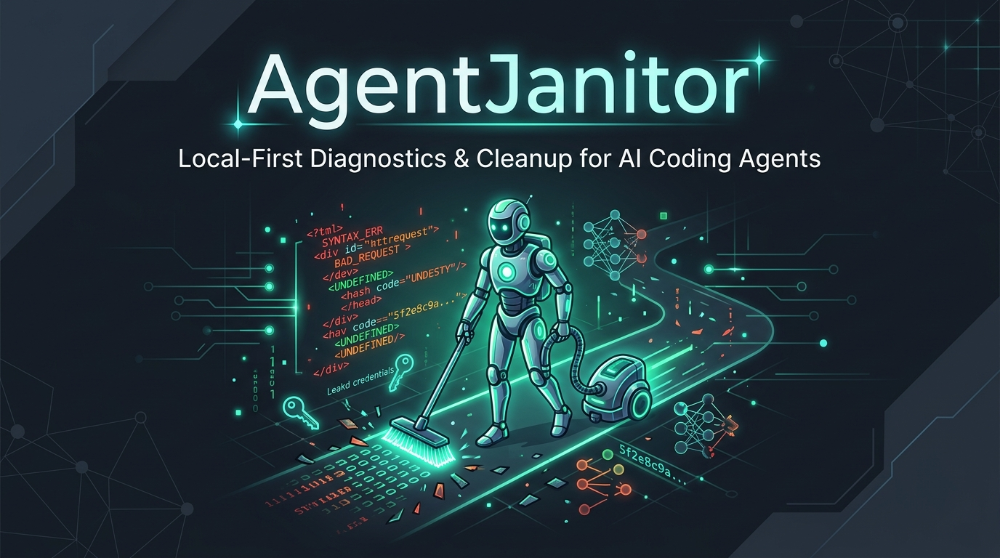
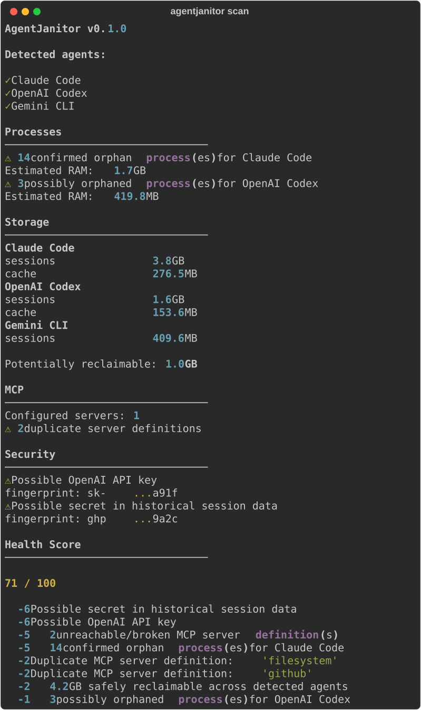
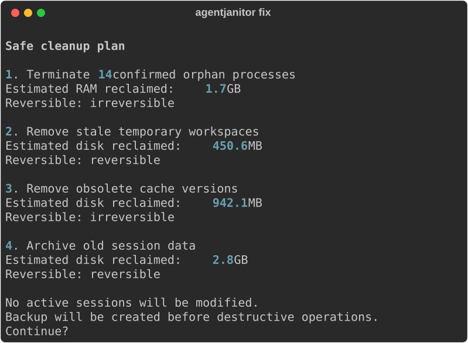

<div align="center">



# 🧹 AgentJanitor

### Local-First Health, Diagnostics & Cleanup Engine for AI Coding Agents & MCP Servers

[](https://www.python.org/)
[](LICENSE)
[](https://modelcontextprotocol.io/)
[](#-supported-agents)
[](#-privacy--safety-guarantees)
[](tests/)

[Türkçe Dokümantasyon](README.tr.md) &nbsp;·&nbsp; [Install](#-installation) &nbsp;·&nbsp; [Quick Start](#-quick-start) &nbsp;·&nbsp; [Supported Agents](#-supported-agents) &nbsp;·&nbsp; [Safety Model](#-safety-model) &nbsp;·&nbsp; [Architecture](#-architecture)

<br>

**Your AI coding agents leave behind leaked helper processes eating RAM, gigabytes of stale session history, broken MCP server definitions, and plaintext API keys. AgentJanitor diagnoses and safely cleans them up.**

</div>

---

## ⚡ The Problem: AI Coding Agent Bloat

AI coding agents (Claude Code, OpenAI Codex, Gemini CLI, Cursor, Aider, OpenCode) spawn background processes, MCP servers, subagents, and session/cache databases. Left unmanaged:

- 🛑 **Orphaned Helper Processes:** Dead parent processes leave background nodes consuming 100% of a CPU core or gigabytes of RAM.
- 💾 **Gigabytes of Stale History:** Session traces, temporary diffs, and context caches quietly fill developer SSDs.
- 🔌 **Broken MCP Server Definitions:** Dead paths, duplicate commands, and failing server registrations slow down agent bootstrap times.
- 🔑 **Exposed API Credentials:** Plaintext tokens and secrets lingering in forgotten config files that were never rotated.

---

## ⚖️ Comparison: AgentJanitor vs Generic Cleaners

| Feature / Capability | Generic Disk Cleaners (CleanMyMac / BleachBit) | Generic Bash / Kill Scripts | 🧹 **AgentJanitor** |
| :--- | :--- | :--- | :--- |
| **Agent Awareness** | ❌ None (treats files as raw bytes) | ❌ Hardcoded PIDs | ✅ **Native Agent & MCP Adapters** |
| **Active Session Protection** | ❌ Blind deletion | ❌ Kills running work | ✅ **Never kills active agent tasks** |
| **MCP Health & De-duplication** | ❌ Not supported | ❌ Not supported | ✅ **Static health checks & deduplication** |
| **Credential Hygiene Scan** | ❌ None | ❌ None | ✅ **Fingerprinted secret scanner** |
| **Reversibility & Undo** | ❌ Permanent deletion | ❌ Irreversible | ✅ **Automatic backup manifest + `undo`** |
| **Dry Run Mode** | ❌ Rare | ❌ No | ✅ **`--dry-run` zero-mutation safety** |
| **Explainable Health Score** | ❌ None | ❌ None | ✅ **0–100 Deterministic score** |

---

## 📸 Real Terminal Output

```bash
$ agentjanitor scan
```



```bash
$ agentjanitor fix
```



<sub>*Both screenshots are real output captured via Rich's SVG renderer.*</sub>

---

## ✨ Features

- 🔍 **Multi-Signal Installation Detection:** Confidence-scored detection of installed AI agent frameworks.
- 🛑 **Conservative Orphan Process Discovery:** Multi-signal classification (`ACTIVE` → `CONFIRMED_ORPHANED`) ensuring active work is never disrupted.
- 🛡️ **Active Session Immunity:** Any process inside an active coding session is strictly protected from termination.
- 📊 **Categorized Disk Reclaim:** Distinguishes safe-reclaimable files, archive candidates, and unknown assets.
- 🔌 **MCP Server Health Checks:** Static validation (binary exists, valid URL, path resolved) and duplicate configuration detector without spawning untrusted third-party binaries.
- 🔐 **Secret & Credential Fingerprinting:** Scans config files for leaked keys, printing only safe truncated fingerprints.
- 🩺 **Agent Doctor Diagnostics (`agentjanitor doctor`):** Deep per-agent checks with actionable fix proposals.
- ⏪ **Safe Execution Engine & Undo (`agentjanitor undo`):** Creates backup manifests before mutations with single-command rollback.

---

## 🤖 Supported Agents

| Agent | Status | Notes |
|---|---|---|
| **Claude Code** | ✅ Supported | Configs, session storage, MCP server configurations |
| **OpenAI Codex** | ✅ Supported | Full process tree and session history discovery |
| **Gemini CLI** | ⚡ Experimental | Process monitoring, cache inspection |
| **Cursor / Cline / Aider** | 📋 Roadmap (v0.2.0) | Adapters in active development |

---

## 🚀 Installation

### Using `uv` (Recommended - Ultra Fast)
```bash
uv tool install agentjanitor
```

### Using `pipx`
```bash
pipx install agentjanitor
```

### Using `pip`
```bash
pip install agentjanitor
```

---

## ⚡ Quick Start

```bash
# 1. Non-destructive scan and health report
agentjanitor scan

# 2. Preview proposed cleanup actions without making changes
agentjanitor fix --dry-run

# 3. Apply safe fixes (only SAFE-risk actions executed)
agentjanitor fix

# 4. Deep diagnostics for your installed agents
agentjanitor doctor

# 5. Undo the last cleanup operation if needed
agentjanitor undo
```

---

## 🛡️ Safety Model

AgentJanitor prioritizes **system safety above aggressive cleanup**:

1. **Dead Parent + Idle Time + Corroborating Signals:** Only processes meeting all 3 criteria are marked `CONFIRMED_ORPHANED`.
2. **Never Kills Active Session Work:** Any active task workspace is completely untouchable.
3. **Session Archival over Deletion:** Old sessions are compressed into archive directories rather than deleted.
4. **Interactive Confirmation:** Destructive actions require explicit confirmation and display exact diffs.
5. **Zero Symlink Traversals:** Disk scanners never escape agent sandboxes via symlinks.

---

## 🔒 Privacy & Safety Guarantees

- ✅ **100% Local Execution** — No cloud backend, no account required.
- ✅ **Zero Telemetry** — Zero analytics, no tracking pings.
- ✅ **No External AI API Calls** — Runs locally without consuming tokens or sending code context.
- ✅ **Deterministic Rules** — Fully explainable, reproducible health scores.

---

## 🏗️ Architecture

```text
src/agentjanitor/
├── cli/            Typer CLI commands (scan, fix, doctor, undo)
├── core/           Scan orchestration, health scoring, config loader
├── adapters/       Agent-specific modules (Claude, Codex, Gemini, etc.)
├── scanners/       Process, storage, session, MCP, and secret scanners
├── diagnostics/    Deep 'doctor' checks per agent
├── cleanup/        Typed action execution with risk ratings
├── backup/         Backup manifest creation and instant rollback
├── reporting/      Rich terminal tables and structured JSON output
└── platform/       OS-agnostic path and process abstractions
```

---

## 🤝 Contributing

Contributions are welcome! Read our [CONTRIBUTING.md](CONTRIBUTING.md) to get started.

## 📄 License

Distributed under the Apache-2.0 License. See [LICENSE](LICENSE) for details.
